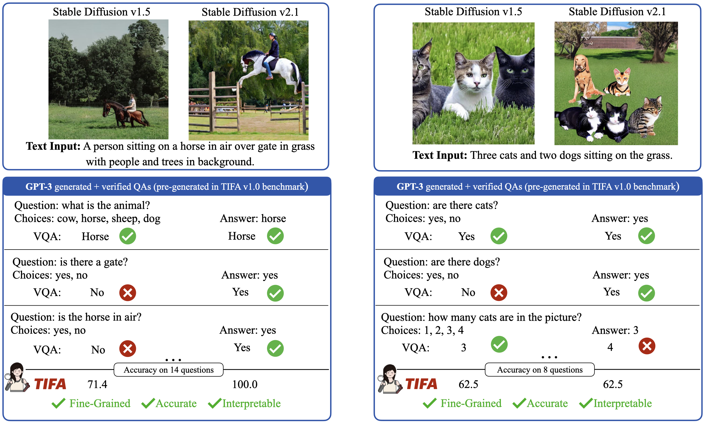

# TIFA: Accurate and Interpretable Text-to-Image Evaluation with Question Answering

This repository contains the code and models for our paper [TIFA: Accurate and Interpretable Text-to-Image Evaluation with Question Answering](https://arxiv.org/abs/2303.11897). Please refer to the [project page](https://tifa-benchmark.github.io/) for a quick overview.



## Components (Coming soon in two days!)

1. TIFA v1.0 benchmark

2. Evaluation Code

3. VQA modules

4. Question Generation modules


## TIFA v1.0 benchmark

TIFA v1.0 text inputs are in `tifa_v1.0/tifa_v1.0_text_inputs.json` 

You can also <a href="https://raw.githubusercontent.com/Yushi-Hu/tifa/main/tifa_v1.0/tifa_v1.0_text_inputs.json" download>Download here</a>

The text inputs are organized as follows:

```console
[
    {
        "id": "coco_301091",    # the unique text id
        "caption": "On a gray day a surfer carrying a white board walks on a beach.",     # the text
        "coco_val_id": "380711"    # for COCO captions only. The COCO image id corresponding to the caption
    },
    ...
]
```

The GPT-3 pre-generated TIFA v1.0 question and answers are in `tifa_v1.0/tifa_v1.0_question_answers.json`. 

You can also <a href="https://raw.githubusercontent.com/Yushi-Hu/tifa/main/tifa_v1.0/tifa_v1.0_question_answers.json" download>Download here</a>

The question and answers are organized as follows:


```console
[
    {
        "id": "coco_301091",    # the unique text id, correspond to the text inputs file
        "caption": "On a gray day a surfer carrying a white board walks on a beach.",    # the text
        "question": "is this a surfer?",
        "choices": [
            "yes",
            "no"
        ],
        "answer": "yes",
        "answer_type": "animal/human",       # the element type
        "element": "surfer",                 # the element the question is about
        "coco_val_id": "380711"              # for COCO captions only. the COCO image id corresponding to the caption
    },
    ...
]
```
