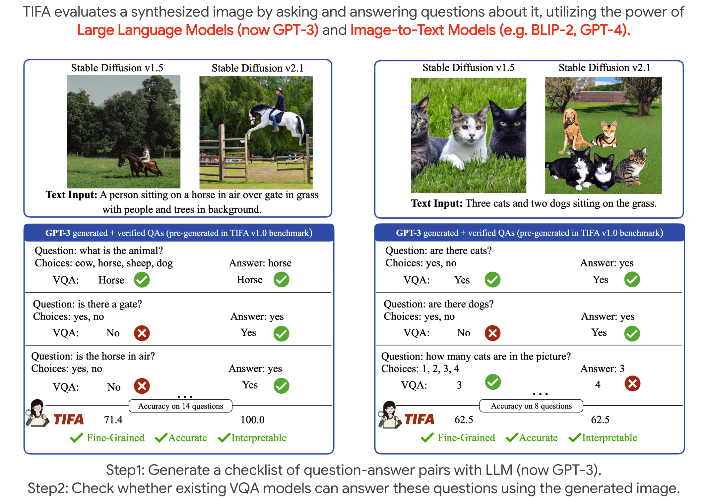
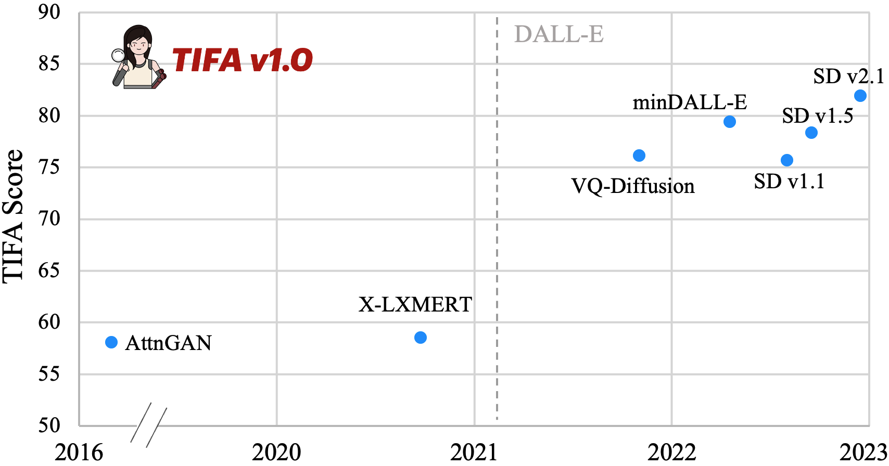
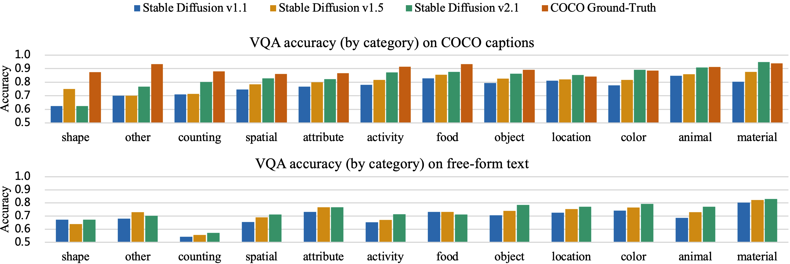

# TIFA: Accurate and Interpretable Text-to-Image Faithfulness Evaluation with Question Answering

This repository contains the code and models for our paper [TIFA: Accurate and Interpretable Text-to-Image Faithfulness Evaluation with Question Answering](https://arxiv.org/abs/2303.11897). Please refer to the [project page](https://tifa-benchmark.github.io/) for a quick overview.



#### Do I need OpenAI API to run TIFA?
No. We have pre-generated the questions with OpenAI APIs, such that users only need to run the VQA models in this repo to benchmark their text-to-image models. 

#### Why TIFA?
TIFA is much more accurate than CLIP, while being fine-grained and interpretable. It is an ideal choice for fine-grained automatic evaluation of image generation. Meanwhile, this repo also provides tools to allow users to customize their own TIFA benchmark.

#### Leaderboard
Want to submit results on the leaderboard? Please email the authors.





**************************** **Updates** ****************************

* TODO: Release Flan-T5 fine-tuned for question generation so that users can generate questions without OpenAI API. Release Huggingface demo.
* 03/24: We released the evaluation package, which includes evaluation code, VQA modules, and question generation modules
* 03/22: We released the TIFA v1.0 captions, questions.


## Quick Links
- [Installation](#Installation)
- [Quick Start](#quick-start)
- [TIFA v1.0 Benchmark](#tifa-v10-benchmark)
- [VQA modules](#vqa-modules)
- [Question Generation modules](#question-generation-modules)
    - [Question Generation with GPT-3.5](#quetion-generation-with-gpt-35)
    - [Filtering with UnifiedQA](#filter-with-unifiedqa)
- [TIFA on arbitrary image and text](#tifa-on-arbitrary-image-and-text)

## Installation

First clone this repo for the examples, readme, etc.
```bash
git clone https://github.com/Yushi-Hu/tifa.git
```

The code and dependencies can be installed by PyPI
```bash
pip install tifascore
```

Or you can manually build it from this repo
```bash
pip install -r requirements.txt
pip install -e .
```

## Quick Start

To benchmark your own text-to-image model:

Suppose we are benchmarking on the text inputs in `sample/sample_text_inputs.json`. The questions are in `sample/sample_question_answers.json`.

1. Generate the images from `sample/sample_text_inputs.json`. We have included sample images in `sample/`
2. Make a JSON file that points out the location of each image. We include an example `sample/sample_imgs.json`.
3. Run the following code. The output is in `sample/sample_evaluation_result.json`.

```python
from tifascore import tifa_score_benchmark
import json

# We recommend using mplug-large
results = tifa_score_benchmark("mplug-large", "sample/sample_question_answers.json", "sample/sample_imgs.json")

# save the results
with open("sample/sample_evaluation_result.json", "w") as f:
    json.dump(results, f, indent=4)
```

### Benchmark on TIFA v1.0 benchmark
To evaluate on TIFA v1.0 benchmark, generate images for text inputs in `tifa_v1.0/tifa_v1.0_text_inputs.json`. and run
```python
results = tifa_score_benchmark("mplug-large", "`tifa_v1.0/tifa_v1.0_question_answers.json", "[YOUR IMAGE PATH]")
```


## TIFA v1.0 Benchmark

TIFA v1.0 text inputs are in `tifa_v1.0/tifa_v1.0_text_inputs.json` 

You can also <a href="https://raw.githubusercontent.com/Yushi-Hu/tifa/main/tifa_v1.0/tifa_v1.0_text_inputs.json" download>Download here</a>

The GPT-3 pre-generated TIFA v1.0 question and answers are in `tifa_v1.0/tifa_v1.0_question_answers.json`. 

You can also <a href="https://raw.githubusercontent.com/Yushi-Hu/tifa/main/tifa_v1.0/tifa_v1.0_question_answers.json" download>Download here</a>


## VQA Modules

We provide easy interface to run VQA inference. The supported image-to-text models include `mplug-large, git-base, git-large, blip-base, blip-large, vilt, ofa-large, promptcap-t5large, blip2-flant5xl`

To peform inference

```python
from tifascore import VQAModel

# automatically on GPU if detect CUDA.
# support all above VQA models. Here we use mplug-large as an example.
model = VQAModel("mplug-large")

# perform free-form VQA
print(model.vqa("sample/drawbench_8.jpg", "What is the fruit?"))
# bananas

# perform multiple-choice VQA
print(model.multiple_choice_vqa("sample/drawbench_8.jpg", "What is the color of the banana?", choices=['black', 'yellow', 'red', 'green']))
# {'free_form_answer': 'yellow', 'multiple_choice_answer': 'yellow'}
```
In this example, the image is . The answer to `what is the fruit?` is `bananas`, and the answer to `what is the color of the banana?` is `yellow`.

## Question Generation Modules

TIFA allows users to generate questions on their own text inputs. The question generation contains two part. First is question generation with GPT-3. And then we filter the questions with UnifiedQA.
We will release a fine-tuned Flan-T5 model so that the users can generate questions locally without OpenAI API. However, the question quality will be lower than GPT-3 generated ones.

### Question generation with GPT 3.5

Notice that since code-davinci-002 is deprecated, we rewrite our code with gpt-3.5-turbo. Since the input length limit is 4097, which is smaller than Codex's, we reduce the number of in-context examples in the current codebase. Thus, the questions will be slightly different from the ones in TIFA v1.0 benchmark.

```python
import openai
from tifascore import get_question_and_answers

openai.api_key = "[Your OpenAI Key]"

text = "a black colored banana."
gpt3_questions = get_question_and_answers(text)
# gpt3_questions is a list of question answer pairs with the same format as sample/sample_question_answers.json
```

### Filter with UnifiedQA

To double-check the questions, we also run UnifiedQA to filter GPT-3 generated questions.

```python
import openai
from tifascore import UnifiedQAModel, filter_question_and_answers

unifiedqa_model = UnifiedQAModel("allenai/unifiedqa-v2-t5-large-1363200")

# filter gpt3_questions
filtered_questions = filter_question_and_answers(unifiedqa_model, gpt3_questions)
```

## TIFA on arbitrary image and text

Combining above modules, we can compute TIFA on arbitary image-text pair.

```python
from tifascore import get_question_and_answers, filter_question_and_answers, UnifiedQAModel, tifa_score_single, VQAModel
import openai

openai.api_key = "[Your OpenAI Key]"
unifiedqa_model = UnifiedQAModel("allenai/unifiedqa-v2-t5-large-1363200")
vqa_model = VQAModel("mplug-large")
    
    
img_path = "sample/drawbench_8.jpg"
text = "a black colored banana."
    
# Generate questions with GPT-3.5-turbo
gpt3_questions = get_question_and_answers(text)
    
# Filter questions with UnifiedQA
filtered_questions = filter_question_and_answers(unifiedqa_model, gpt3_questions)
    
# See the questions
print(filtered_questions)

# calucluate TIFA score
result = tifa_score_single(vqa_model, filtered_questions, img_path)
print(f"TIFA score is {result['tifa_score']}")   # 0.33
print(result)
```

In this example, TIFA score between the text `a black colored banana` and  is 0.33.


## Details: The text inputs format and the question-answer pairs format

The text inputs are organized as follows:
```console
[
    {
        "id": "coco_301091",    # the unique text id
        "caption": "On a gray day a surfer carrying a white board walks on a beach.",     # the text
        "coco_val_id": "380711"    # for COCO captions only. The COCO image id corresponding to the caption
    },
    ...
]
```

The question and answers are organized as follows:
```console
[
    {
        "id": "coco_301091",    # the unique text id, correspond to the text inputs file
        "caption": "On a gray day a surfer carrying a white board walks on a beach.",    # the text
        "question": "is this a surfer?",
        "choices": [
            "yes",
            "no"
        ],
        "answer": "yes",
        "element_type": "animal/human",       # the element type
        "element": "surfer",                 # the element the question is about
        "coco_val_id": "380711"              # for COCO captions only. the COCO image id corresponding to the caption
    },
    ...
]
```

## Citation
If you find our work helpful, please cite us:

```bibtex
@article{Hu2023TIFAAA,
  title={TIFA: Accurate and Interpretable Text-to-Image Faithfulness Evaluation with Question Answering},
  author={Yushi Hu and Benlin Liu and Jungo Kasai and Yizhong Wang and Mari Ostendorf and Ranjay Krishna and Noah A. Smith},
  journal={ArXiv},
  year={2023},
  volume={abs/2303.11897}
}
```

